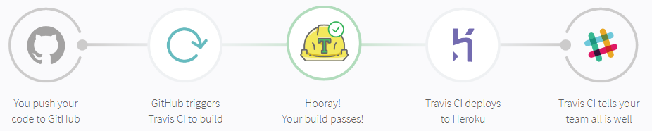

# Deploying a Web Application + DB

#### Prerequisite for this workshop
1) Have `Docker` installed on your machine
2) Have `node` and `npm` installed on your machine
3) Have a `Github` account
4) Have a `TravisCI` account
5) Have a `Heroku` account

<br>

###  1. Setup

Create an `.env` file in `root` folder with the following properties:

```
DB=sample-local-db
DB_USERNAME=sample-local-user
DB_PASSWORD=sample-local-password
DB_HOST=127.0.0.1
DB_PORT=3306
```

Install the required dependencies for this web app by running:

```
npm install
```

Finally, run this command to create a local dockerized version of MySQL in your machine:

```
npm run db:local
```

### 2a. Running a production version locally

To get the *feel* of how your application behaves in production, you can run this command to spin up the application locally with production settings 
```
npm run prod
```
`Tip`: to utilise the DB, you have to run `npm run db:local` with the correct `.env` keys in the previous step 
<br>

### 2b. Running tests

To illustrate the point of deploying untested code to an environment, we will not use the default `npm test` command, but instead:
```
npm run unit:test
```
<br>

### 3. Making your application compatible with Heroku

By default, Heroku already has the node engine to run **nodejs** applications. What we need is a Heroku-ready Cloud Database for our application: `JawsDB`

Download the add-on `JawsDB` from Heroku and fill in its credentials in:

`Settings > Config Vars > [Reveal Config Vars]`

```
DB=__________________JAWS_DB_________
DB_USERNAME=_________JAWS_DB_________
DB_PASSWORD=_________JAWS_DB_________
DB_HOST=_____________JAWS_DB_________
DB_PORT=_____________JAWS_DB_________
```

<br>

## Sample deployment flow


## Sample Travis CI script for deployment to Heroku
*Answer script below!*
<br>
<br>
<br>
<br>
<br>
<br>
<br>
<br>
<br>
<br>
<br>
<br>

**.travis.yml**

```
language: node_js

node_js: 
  - 10.13.0

install:
  - npm install

script:
  - npm run unit:test

deploy:
  provider: heroku
  skip_cleanup: true
  app: sample-deploy-1
  api_key: 
      secure: $HEROKU_API_KEY
  on:
    branch: master
```